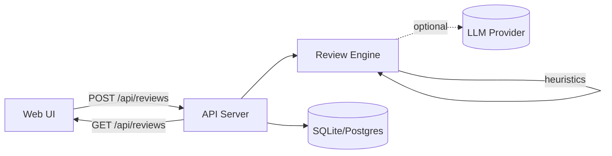

# PR Buddy — Architecture

## Components

- **Web UI (static SPA)**: `project/src/web/` — form to paste a diff/URL and view per-file comments + final summary.
- **API/Backend (Node.js)**: `project/src/server.js` — validates requests, runs the review engine, and persists results.
- **Review engine**: `project/src/review/` — diff parsing + heuristics + (optional) LLM call.
- **DB**: `project/src/db/` — persistence for reviews, policies, and metrics.
  - **SQLite** (default): uses `node:sqlite` (no external dependencies).
  - **Postgres** (optional): via `pg` (installation/documentation in the README).

## Core flow (MVP)

1. The user pastes a diff in the UI and clicks **Review**.
2. The UI calls `POST /api/reviews` with the diff.
3. The backend:
   - parses the diff (files/hunks/lines)
   - computes risks, suggestions, nitpicks and missing tests
   - applies a policy (if configured)
   - stores the review and metrics in the database
4. The UI renders:
   - **Final summary** (risk, highlights, missing tests, checklist)
   - **Per-file comments**

## Extensions (roadmap)

- **GitHub**: webhook to receive PR events, fetch diffs/files, and publish review comments/check-runs.
- **Blocking policies**: fail a check-run when `policy.passed=false`.
- **Automatic quality evaluation**: compare PR Buddy output with human reviews (LLM-as-judge + metrics).
- **Dashboard**: aggregated metrics (error types, time saved, hotspots by repo).

## Diagram (Mermaid)

