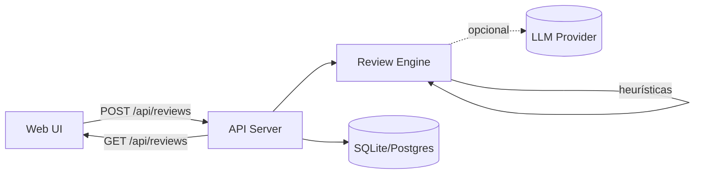

# PR Buddy — Arquitetura

## Componentes

- **Web UI (SPA estática)**: `project/src/web/` — formulário para colar um diff/URL e visualizar o review por ficheiro + resumo.
- **API/Backend (Node.js)**: `project/src/server.js` — valida requests, executa o motor de review e persiste resultados.
- **Motor de review**: `project/src/review/` — parsing de diff + heurísticas + (opcional) chamada a LLM.
- **DB**: `project/src/db/` — persistência de reviews, políticas e métricas.
  - **SQLite** (default): usa `node:sqlite` (sem dependências externas).
  - **Postgres** (opcional): via `pg` (instalação/documentação no README).

## Fluxo principal (MVP)

1. O utilizador cola um diff na UI e clica **Review**.
2. A UI chama `POST /api/reviews` com o diff.
3. O backend:
   - faz parse do diff (ficheiros/hunks/linhas)
   - calcula riscos, sugestões, nitpicks e testes em falta
   - aplica uma política (se existir)
   - grava o review e métricas na base de dados
4. A UI renderiza:
   - **Resumo final** (risco, highlights, missing tests, checklist)
   - **Comentários por ficheiro**

## Extensões (roadmap)

- **GitHub**: webhook para receber eventos de PR, obter diff/ficheiros e publicar comentários/check-runs.
- **Políticas “blocking”**: falhar check-run quando `policy.passed=false`.
- **Avaliação automática de qualidade**: comparar output do PR Buddy com reviews humanos (LLM-as-judge + métricas).
- **Dashboard**: métricas agregadas (tipos de erros, tempo poupado, padrões por repo).

## Diagrama (Mermaid)

